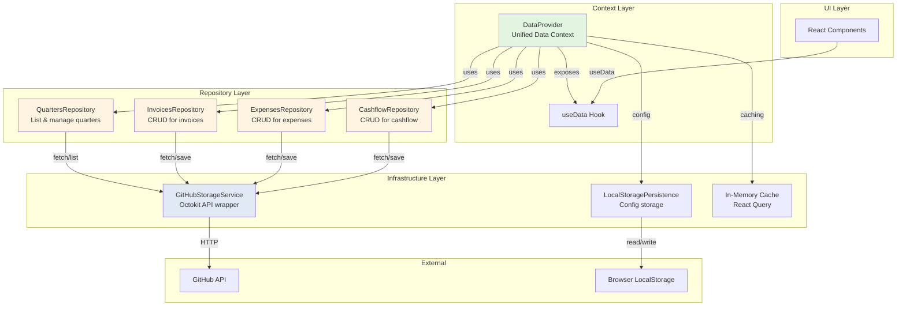

# Data Architecture

This document describes the data access layer architecture for Peris, following clean architecture principles.

## Overview

Peris uses a layered architecture that separates concerns between infrastructure (GitHub API), data repositories (business logic), and React context (state management).

## Architecture Diagram



## Layer Responsibilities

### 1. UI Layer (Components)
- **Location**: `components/`
- **Responsibility**: Render UI and handle user interactions
- **Dependencies**: Only uses `useData()` hook from context
- **Example**: `InvoicesView`, `ExpensesView`, `CashflowView`

### 2. Context Layer
- **Location**: `lib/data/context/`
- **Components**:
  - `DataProvider`: Unified context combining storage selection, editing state, and data fetching
  - `useData()`: Single hook exposing all data operations
- **Responsibility**: 
  - Manage application state (storage config, editing state)
  - Coordinate between repositories
  - Encapsulate React Query for caching
  - Provide unified API to components

### 3. Repository Layer
- **Location**: `lib/data/repositories/`
- **Components**:
  - `QuartersRepository`: List quarters, validate storage
  - `InvoicesRepository`: Fetch/save invoices for a quarter
  - `ExpensesRepository`: Fetch/save expenses for a quarter
  - `CashflowRepository`: Fetch/save cashflow for a quarter
- **Responsibility**:
  - Business-specific data operations
  - Domain model transformation
  - Coordinate between infrastructure and context
- **Pattern**: Each repository is a class with methods for its domain

### 4. Infrastructure Layer
- **Location**: `lib/data/infrastructure/`
- **Components**:
  - `GitHubStorageService`: Low-level GitHub API wrapper
  - `LocalStoragePersistence`: Browser storage for config
- **Responsibility**:
  - Technical implementation details
  - External API communication
  - Persistence mechanisms
- **Independence**: No business logic, pure technical layer

## Data Flow

### Reading Data (e.g., Load Invoices)
```
Component → useData() → DataContext → InvoicesRepository → GitHubStorageService → GitHub API
                ↓
           Cache Check (React Query)
                ↓
           Return cached or fresh data
```

### Writing Data (e.g., Save Invoice)
```
Component → useData() → DataContext → Update In-Memory State
                                    ↓
                              User clicks "Commit"
                                    ↓
                    InvoicesRepository → GitHubStorageService → GitHub API
                                    ↓
                             Invalidate Cache
                                    ↓
                           Refresh all data
```

### Editing Flow
1. **Load**: Data fetched from GitHub (or cache)
2. **Edit**: Changes stored in-memory in DataContext
3. **Commit**: All changes pushed to GitHub in single transaction
4. **Refresh**: Cache invalidated, fresh data loaded

## Key Design Decisions

### 1. Single Unified Context
Instead of separate `StorageContext` and `EditingStateContext`, we have one `DataProvider` that manages all state. This simplifies component usage and ensures consistency.

**Benefits**:
- Single source of truth
- Easier to coordinate between storage and editing
- Simpler API for components

### 2. Encapsulated React Query
React Query is used internally by DataContext but not exposed to components. Components only see loading/error/data states through `useData()`.

**Benefits**:
- Can change caching strategy without affecting components
- Centralized cache management
- Cleaner component code

### 3. Repository Pattern
Business logic separated into repository classes, one per domain entity (quarters, invoices, expenses, cashflow).

**Benefits**:
- Clear separation of concerns
- Easy to test
- Domain-focused organization

### 4. Infrastructure Abstraction
GitHub API details hidden behind GitHubStorageService. Could swap to different backend without changing repositories.

**Benefits**:
- Technology independence
- Easier testing (mock infrastructure)
- Clear boundary between business and technical code

## Persistence Mechanism

### GitHub as Storage Backend

Peris uses GitHub repositories as the persistence backend. Each quarter's data is stored in a folder structure:

```
<repo-root>/<data-path>/
├── 2024.4Q/
│   ├── invoices.json
│   ├── expenses.json
│   ├── cashflow.json
│   ├── invoices/
│   │   └── INV-001.pdf
│   └── expenses/
│       └── EXP-001.pdf
├── 2025.1Q/
│   ├── invoices.json
│   ├── expenses.json
│   └── cashflow.json
...
```

### Authentication
- **Personal Access Token (PAT)**: Embedded in repository URL
- **Format**: `https://[PAT@]github.com/owner/repo[/path]`
- **Scopes Required**: `repo` (for private repos) or `public_repo` (for public repos)

### Operations

#### Read Operations
- **List Quarters**: Query repo tree structure via GitHub API
- **Load Quarter Data**: Fetch individual JSON files via Contents API
- **Lazy Loading**: Only load data when needed, cache in React Query

#### Write Operations
- **Batch Commits**: All changes (JSON + PDFs) committed together
- **Atomic Updates**: Uses GitHub's multi-file commit API
- **SHA Tracking**: Store file SHAs for optimistic updates

#### Caching Strategy
- **React Query**: 5-minute stale time for all queries
- **Editing Override**: In-memory edits bypass cache until committed
- **Invalidation**: All queries invalidated after successful commit

### Configuration Storage
- **Location**: Browser localStorage
- **Key**: `peris_storage_config`
- **Contents**: List of GitHub repos + active selection
- **Purpose**: Persist user's storage configuration across sessions

## Migration Notes

### What Changed
1. **File Organization**: Storage files moved to `lib/data/` with subdirectories
2. **Imports**: Updated from `@/lib/use-storage-*` to `@/lib/data/context`
3. **API**: Single `useData()` hook instead of multiple hooks
4. **Context**: Combined StorageProvider + EditingStateProvider into DataProvider

### Breaking Changes
None - components updated to use new API but functionality unchanged

### Backward Compatibility
Old localStorage config (`peris_storage_config`) automatically migrated
